# FarmaLog


Sistema distribuido que automatiza el ingreso de pedidos de laboratorios farmacéuticos a un ERP. Reemplaza un proceso que hoy se hace a mano.

Modelé el dominio a partir de procesos reales de un operador logístico 3PL. El nombre de la empresa y los códigos son ficticios.

## El problema

Un operador logístico recibe los pedidos de los laboratorios en planillas Excel, y alguien tiene que ingresarlos al ERP uno por uno. Es lento, y cualquier error de digitación puede terminar en un despacho equivocado.

Este sistema automatiza ese ingreso respetando dos reglas que vienen del negocio:

- Si el archivo tiene un error, no se ingresa ningún pedido, ni siquiera los que estaban bien. Así funciona el sistema real: una carga a medias es peor que ninguna, porque después nadie sabe qué quedó adentro.
- Los errores se informan por pedido y no por fila. Quien corrige la planilla necesita saber qué pedido está mal, no en qué celda.

## Arquitectura

```mermaid
flowchart LR
    subgraph S1["Portal (Blazor Server)"]
        UI["Pantalla de carga"]
    end

    subgraph S2["Ingesta (Minimal API)"]
        PIPE["Lectura, agrupación,<br/>validación y ACL"]
    end

    COLA[["Cola de Service Bus<br/>registrar-solicitud-ingreso"]]

    subgraph S3["Núcleo (Worker en Container Apps)"]
        W["Worker<br/>KEDA: 0 a 3 réplicas"]
        AGG["Agregado<br/>SolicitudDeIngresoPedido"]
    end

    DB[("Azure SQL")]
    DLQ[["Dead-letter"]]

    UI -->|"HTTP multipart"| PIPE
    PIPE -.->|"respuesta inmediata:<br/>publicados y errores"| UI
    PIPE -->|"comando"| COLA
    COLA --> W --> AGG --> DB
    COLA -.->|"después de 3 intentos"| DLQ

    classDef portal fill:#ECEFF1,stroke:#455A64,color:#1C2833
    classDef ingesta fill:#FFF3E0,stroke:#E65100,color:#3E2723
    classDef nucleo fill:#E3F2FD,stroke:#1565C0,color:#0D2A4A
    classDef infra fill:#E8F5E9,stroke:#2E7D32,color:#1B3A1F
    classDef error fill:#FFEBEE,stroke:#C62828,color:#4A0E0E

    class UI portal
    class PIPE ingesta
    class W,AGG nucleo
    class COLA,DB infra
    class DLQ error

    style S1 fill:#F7F9FA,stroke:#455A64,color:#1C2833
    style S2 fill:#FFF8F0,stroke:#E65100,color:#3E2723
    style S3 fill:#F3F9FE,stroke:#1565C0,color:#0D2A4A
```



Son tres servicios. Para separarlos usé criterios concretos: quién es dueño de los datos, cada cuánto cambia cada parte y cómo escala. El detalle está en el [ADR-0001](docs/adr/0001-corte-de-microservicios.md).

| Servicio | Qué hace | Estado |
|---|---|---|
| **Portal** | Blazor Server. Permite elegir laboratorio, tipo de orden y archivo. | Sin estado propio |
| **Ingesta** | Minimal API. Lee el Excel, agrupa, valida y traduce al contrato del dominio. | Sin base de datos |
| **Núcleo** | Worker que consume la cola, arma el agregado y lo guarda. | Único dueño de los datos |

Portal e Ingesta se comunican por HTTP porque hay una persona esperando la respuesta en pantalla. Entre Ingesta y el Núcleo uso una cola, porque una vez aceptado el pedido, su registro no tiene por qué depender de que el Núcleo esté disponible en ese momento.

## Decisiones de diseño

Documenté las cuatro decisiones más importantes como ADR, incluyendo las alternativas que descarté:

| | |
|---|---|
| [ADR-0001](docs/adr/0001-corte-de-microservicios.md) | Cómo separé los microservicios sin caer en uno por entidad |
| [ADR-0002](docs/adr/0002-contratos-duplicados-por-servicio.md) | Por qué dupliqué los contratos en vez de usar un proyecto compartido, y lo que eso ya costó |
| [ADR-0003](docs/adr/0003-closedxml-sobre-epplus.md) | ClosedXML en lugar de EPPlus, por un tema de licencia |
| [ADR-0004](docs/adr/0004-imagen-base-debian.md) | Imagen base Debian, porque un requisito del negocio lo exigía |

Hay otras tres que se ven directamente en el código.

**Idempotencia.** Service Bus entrega los mensajes *at-least-once*, así que el mismo mensaje puede llegar dos veces. En vez de consultar antes de insertar (lo que deja espacio para condiciones de carrera), usé una restricción única en la base de datos y convierto esa excepción en un resultado con nombre propio (`ResultadoGuardado`). Quien decide si un registro está duplicado es la base de datos.

**Anti-corruption layer.** `CodigosD365Mapper` traduce los códigos del ERP al modelo de dominio. Está en Ingesta y no en el Núcleo porque cambia cada vez que entra un laboratorio nuevo o cambia el ERP, y no tiene sentido redesplegar el servicio dueño de los datos por un cambio de formato externo.

**Formato versus reglas de negocio.** La validación del archivo (que una fecha se pueda leer, que una columna exista) está en el borde, en `FormatValidator`. Las reglas del pedido están en el dominio, como invariantes del agregado. Parecen lo mismo pero no lo son: una revisa el formato y la otra define qué es un pedido válido.

## Cómo levantarlo

### Requisitos

- .NET 10 SDK
- Azure CLI con sesión iniciada (`az login --use-device-code`)
- Una suscripción de Azure

### 1. Crear la infraestructura

```bash
bash infra/provision.sh
```

El script es idempotente: revisa qué existe en el resource group y crea solo lo que falta, así que se puede ejecutar con el entorno vacío, a medias o completo. No contiene secretos ni inicia sesión; solo verifica que haya una sesión activa y se detiene si no la encuentra.

Al terminar genera un archivo `.env.local` con las connection strings.

Para apagar los recursos que cobran por hora sin borrar todo:

```bash
bash infra/teardown.sh
```

### 2. Cargar las variables de entorno

```bash
while IFS= read -r linea; do
  [[ "$linea" == *=* && "$linea" != \#* ]] && export "${linea%%=*}=${linea#*=}"
done < .env.local
```

> No uses `source`. Las connection strings tienen `;` y `source` los interpreta como separadores de comandos, así que al proceso le llega solo el host, sin la clave. Ingesta tiene una validación al arrancar que detecta justamente ese caso.

### 3. Levantar los servicios

```bash
dotnet run --project src/FarmaLog.Ingesta   # escucha en el puerto 5091
dotnet run --project src/FarmaLog.Portal    # en otra terminal
```

Abre la URL que muestra el Portal, elige laboratorio y tipo de orden y sube una planilla.

### Probar Ingesta sin el Portal

```bash
curl -i -X POST http://localhost:5091/cargas \
  -F "archivo=@tests/FarmaLog.Ingesta.Tests/Fixtures/template-real.xlsx" \
  -F "codigoLaboratorio=23" \
  -F "tipoOrdenVenta=23F1"
```

## Pruebas

```bash
dotnet test
```

Trabajé con TDD desde el primer caso de uso. Hay cuatro proyectos de prueba, separados por capa:

| Proyecto | Qué prueba | Necesita infraestructura |
|---|---|---|
| `Nucleo.Domain.Tests` | Invariantes del agregado y de cada value object | No |
| `Nucleo.Application.Tests` | El caso de uso, con dobles de prueba propios | No |
| `Ingesta.Tests` | Lectura del Excel, agrupación, validación y ACL | No |
| `Nucleo.Infrastructure.Tests` | Repositorio, dispatcher y handler | Sí |

Los dobles de prueba de `Application.Tests` los escribí a mano en vez de usar una librería de mocks: `RelojFijo`, `GeneradorDeIdentificadoresFijo` y `RepositorioDeSolicitudesEnMemoria`. Cada uno implementa un puerto de la capa de aplicación, que es justamente para lo que existen esos puertos.

Los fixtures de `Ingesta.Tests` incluyen una copia del template real de la planilla, con datos ficticios.

## Estructura

```
src/
├── FarmaLog.Portal/                 Blazor Server
├── FarmaLog.Ingesta/                Minimal API
│   ├── Planilla/                    lectura del Excel y agrupación
│   ├── Validation/                  validación de formato
│   ├── Publishing/                  ACL y contratos hacia el Núcleo
│   └── Api/                         contrato hacia el Portal
├── FarmaLog.Nucleo.Domain/          agregado, value objects e invariantes
├── FarmaLog.Nucleo.Application/     casos de uso y puertos
├── FarmaLog.Nucleo.Infrastructure/  EF Core, mensajería y reloj
└── FarmaLog.Nucleo.Worker/          consumidor de la cola
infra/                               scripts de aprovisionamiento y apagado
docs/                                ADRs y diagramas
```

Las dependencias del Núcleo apuntan hacia adentro: `Domain` no depende de nadie, `Application` define los puertos e `Infrastructure` los implementa.

En Ingesta, la carpeta `Publishing/Contracts/` está separada a propósito. Hay dos contratos que van en direcciones opuestas y tienen reglas distintas: el que va al Núcleo no se puede cambiar sin coordinar un despliegue, y el que va al Portal sí.

## Deuda técnica conocida

La fui registrando mientras desarrollaba:

| Deuda | Por qué importa |
|---|---|
| El `MessageId` que uso para deduplicar es más acotado que la clave única de la base | Dos mensajes distintos podrían chocar dentro de la ventana de deduplicación |
| No hay test de contrato entre las copias duplicadas del mensaje | Ya causó un error una vez: un renombre no se reflejó al otro lado y el compilador no lo detectó |
| `CargaProcessor` publica directamente, sin una interfaz `IPedidoPublisher` | No se puede probar sin Azure. Es el único punto de Ingesta que no respeta DIP |
| La conexión a Service Bus usa connection string y no Managed Identity | Fue una decisión de alcance. Conozco el diseño con identidad administrada, pero lo dejé para después |
| No se valida que las filas de un mismo pedido tengan la misma cabecera | Si dos filas no coinciden, hoy se toma la primera. Lo correcto sería rechazar el pedido |

## Fuera de alcance

Este repositorio es la primera rebanada vertical del sistema: un flujo completo que va desde el archivo hasta la base de datos.

Quedaron diseñadas pero sin construir la replicación hacia el ERP (como Azure Function), las notificaciones, el tópico `resultado-replicacion` y la autenticación. Portal e Ingesta corren en local contra recursos reales de Azure. Solo containericé y desplegué el Worker, porque repetir lo mismo con los otros dos servicios no aportaba nada nuevo a nivel de arquitectura.

## Licencia

MIT
