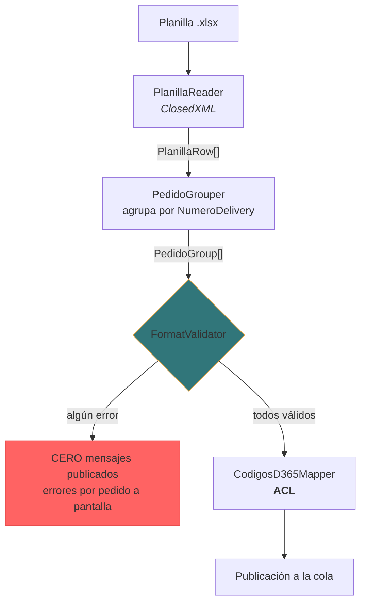

# Arquitectura — FarmaLog

Sistema de ingesta de pedidos de laboratorio hacia D365, en reemplazo de la carga manual.

---

## 1. Vista de servicios

```mermaid
flowchart LR
    Marcela(["Operaciones<br/>(sube la planilla)"])

    subgraph S1["FarmaLog.Portal · Blazor Server"]
        UI["Pantalla de carga<br/>laboratorio · tipo de orden · planilla"]
    end

    subgraph S2["FarmaLog.Ingesta · Minimal API"]
        PIPE["Parseo → agrupación → validación → ACL"]
    end

    COLA[["Cola<br/>registrar-solicitud-ingreso<br/>MaxDelivery 3 · Lock 1m · dedup 10m"]]

    subgraph S3["FarmaLog.Nucleo · Worker en Container Apps"]
        W["RegistrarSolicitudWorker<br/>KEDA · 0 a 3 réplicas"]
        AGG["Agregado<br/>SolicitudDeIngresoPedido"]
    end

    DB[("Azure SQL<br/>farmalog-nucleo<br/>único dueño de los datos")]

    Marcela --> UI
    UI -->|"HTTP multipart<br/>POST /cargas"| PIPE
    PIPE -.->|"respuesta sincrónica:<br/>N publicados + errores"| UI
    PIPE -->|"comando<br/>RegistrarSolicitudIngreso"| COLA
    COLA -->|"escala por profundidad<br/>de cola"| W
    W --> AGG --> DB
    COLA -.->|"tras 3 intentos"| DLQ[["Dead-letter queue"]]

    style S2 fill:#B8B6AE,stroke:#e8a33d
    style S3 fill:#0D9EFF,stroke:#3d8ee8
    style S1 fill:#4D4D4D,stroke:#888
```

**Dónde está cada frontera:**

| Frontera | Qué la justifica |
|---|---|
| Portal ↔ Ingesta | **HTTP sincrónico, no cola.** Hay una persona esperando la respuesta en pantalla. Un canal asíncrono acá obligaría a inventar un canal de vuelta para reportar errores. |
| Ingesta ↔ Núcleo | **Cola, no HTTP.** El pedido ya fue aceptado; su registro no depende de que el Núcleo esté disponible en ese instante. Desacopla disponibilidad y permite escalar por carga. |
| Núcleo ↔ Azure SQL | El Núcleo es el **único dueño de los datos**. Nadie más escribe esa base. |

**El ACL** (`CodigosD365Mapper`) vive dentro de Ingesta, en `Publishing/`, deliberadamente **fuera** de `Publishing/Contracts/`: el traductor no es lo traducido.

---

## 2. Pipeline interno de Ingesta

**Tres decisiones legibles en este diagrama:**

1. **El lector lee, no decide.** `PlanillaReader` no valida: emite filas crudas. La validación es una etapa aparte.
2. **Agrupar precede a validar**, porque el error se reporta *por pedido*. No se puede decir "el pedido X tiene la fecha rota" antes de saber qué filas forman el pedido X.
3. **Todo o nada.** El rombo tiene una sola salida hacia la publicación. Un archivo con un error no publica *nada* — igual que el sistema real.

El validador trabaja en **dos alcances**: las reglas de cabecera se evalúan una vez sobre `Rows[0]`; las de línea con un cuantificador existencial (`Any`) sobre todas las filas. Un `bool` solo puede producir cero o un error, así que **la unicidad del mensaje sale de la forma de la pregunta, no de un `Distinct()` posterior.**

---

## 3. Lo que este diagrama declara y no esconde

- **Portal e Ingesta corren en local** contra recursos reales de Azure. Decisión de alcance: el Worker ya demuestra containerización y despliegue; repetirlo con dos servicios más no agrega evidencia arquitectónica.
- **Los contratos están duplicados** a ambos lados de la cola, a propósito. Ver [ADR-0002](../adr/0002-contratos-duplicados-por-servicio.md).
- **La rebanada 2** (Replicación como Azure Function → D365, tópico `resultado-replicacion`) está diseñada y fuera de alcance.
