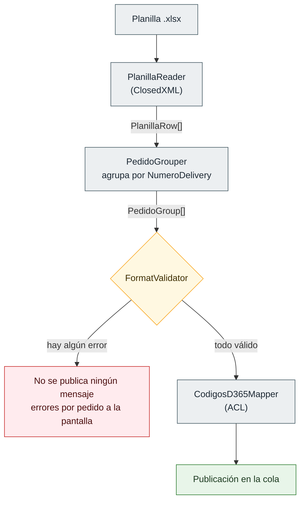

# Arquitectura de FarmaLog

Sistema que ingresa los pedidos de los laboratorios al ERP (D365) y reemplaza la carga manual.

## 1. Vista de servicios

```mermaid
flowchart LR
    OPS(["Operaciones<br/>sube la planilla"])

    subgraph S1["FarmaLog.Portal (Blazor Server)"]
        UI["Pantalla de carga<br/>laboratorio, tipo de orden y planilla"]
    end

    subgraph S2["FarmaLog.Ingesta (Minimal API)"]
        PIPE["Lectura, agrupación,<br/>validación y ACL"]
    end

    COLA[["Cola registrar-solicitud-ingreso<br/>MaxDelivery 3, Lock 1 min, dedup 10 min"]]

    subgraph S3["FarmaLog.Nucleo (Worker en Container Apps)"]
        W["RegistrarSolicitudWorker<br/>KEDA: 0 a 3 réplicas"]
        AGG["Agregado<br/>SolicitudDeIngresoPedido"]
    end

    DB[("Azure SQL farmalog-nucleo<br/>único dueño de los datos")]
    DLQ[["Dead-letter queue"]]

    OPS --> UI
    UI -->|"HTTP multipart<br/>POST /cargas"| PIPE
    PIPE -.->|"respuesta inmediata:<br/>publicados y errores"| UI
    PIPE -->|"comando<br/>RegistrarSolicitudIngreso"| COLA
    COLA -->|"escala según<br/>mensajes en cola"| W
    W --> AGG --> DB
    COLA -.->|"después de 3 intentos"| DLQ

    classDef actor fill:#FFFFFF,stroke:#424242,color:#212121
    classDef portal fill:#ECEFF1,stroke:#455A64,color:#1C2833
    classDef ingesta fill:#FFF3E0,stroke:#E65100,color:#3E2723
    classDef nucleo fill:#E3F2FD,stroke:#1565C0,color:#0D2A4A
    classDef infra fill:#E8F5E9,stroke:#2E7D32,color:#1B3A1F
    classDef error fill:#FFEBEE,stroke:#C62828,color:#4A0E0E

    class OPS actor
    class UI portal
    class PIPE ingesta
    class W,AGG nucleo
    class COLA,DB infra
    class DLQ error

    style S1 fill:#F7F9FA,stroke:#455A64,color:#1C2833
    style S2 fill:#FFF8F0,stroke:#E65100,color:#3E2723
    style S3 fill:#F3F9FE,stroke:#1565C0,color:#0D2A4A
```

Cada frontera tiene su razón:

| Frontera | Por qué es así |
|---|---|
| Portal ↔ Ingesta | HTTP sincrónico y no una cola, porque hay una persona esperando la respuesta en pantalla. Con un canal asíncrono tendría que inventar otro camino de vuelta solo para mostrar los errores. |
| Ingesta ↔ Núcleo | Cola y no HTTP. Una vez aceptado el pedido, su registro no tiene por qué depender de que el Núcleo esté disponible en ese momento. Además permite escalar según la carga. |
| Núcleo ↔ Azure SQL | El Núcleo es el único dueño de los datos. Ningún otro servicio escribe en esa base. |

El ACL (`CodigosD365Mapper`) está dentro de Ingesta, en `Publishing/`, pero fuera de `Publishing/Contracts/`. Lo separé así a propósito: el traductor y lo que se traduce son cosas distintas.

## 2. Flujo interno de Ingesta

En este diagrama se ven tres decisiones:

1. **El lector solo lee.** `PlanillaReader` no valida nada: entrega las filas tal como vienen. La validación es un paso aparte.
2. **Primero se agrupa y después se valida,** porque los errores se informan por pedido. No puedo decir "el pedido X tiene la fecha mal" sin saber antes qué filas forman el pedido X.
3. **Todo o nada.** Desde el validador hay un solo camino hacia la publicación. Si el archivo tiene un error, no se publica nada, igual que en el sistema real.

El validador revisa en dos niveles. Las reglas de cabecera se evalúan una sola vez sobre la primera fila, y las de línea usan `Any` sobre todas las filas. Como un `bool` solo puede dar cero o un error, cada mensaje aparece una sola vez por cómo está planteada la pregunta, sin necesidad de un `Distinct()` al final.

## 3. Lo que queda declarado

- **Portal e Ingesta corren en local** contra recursos reales de Azure. Fue una decisión de alcance: el Worker ya muestra la parte de contenedores y despliegue, y repetirlo con los otros dos servicios no aportaba nada nuevo.
- **Los contratos están duplicados** a ambos lados de la cola, a propósito. Ver [ADR-0002](../adr/0002-contratos-duplicados-por-servicio.md).
- **La rebanada 2** (Replicación hacia D365 como Azure Function y el tópico `resultado-replicacion`) está diseñada pero queda fuera del alcance.